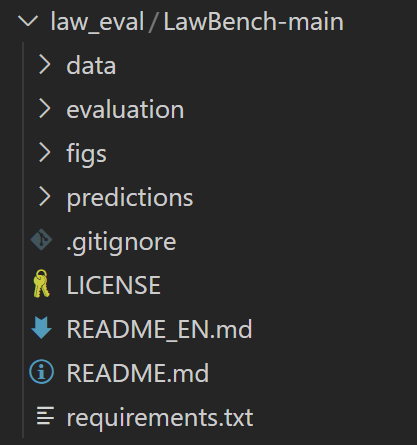
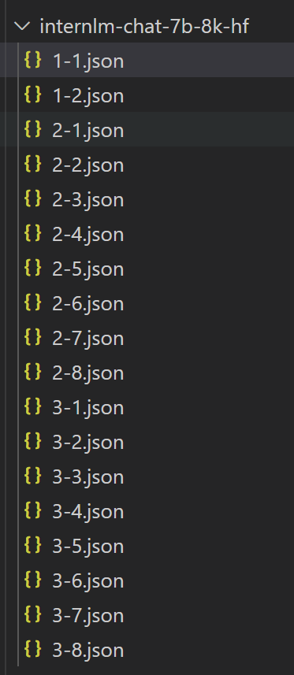

# Model Evaluation
模型评估基于[open-compass/LawBench](https://github.com/open-compass/LawBench)。
## 评估流程
### 1. 数据集下载
将open-compass/LawBench clone到本地，项目结构如下：


评估使用的数据在`data/`下，分为`zero-shot`和`one-shot`两种类别。每个类别下包括十几个`json`文件，每个文件中都保存了若干问题和对应的答案，一个例子如下：
```
# data/zero-shot/1-1.json
[
  {
    "instruction": "回答以下问题，只需直接给出法条内容:",
    "question": "民法商法农民专业合作社法第三十三条的内容是什么？",
    "answer": "答案:农民专业合作社设理事长一名，可以设理事会。理事长为本社的法定代表人。,农民专业合作社可以设执行监事或者监事会。理事长、理事、经理和财务会计人员不得兼任监事。,理事长、理事、执行监事或者监事会成员，由成员大会从本社成员中选举产生，依照本法和章程的规定行使职权，对成员大会负责。,理事会会议、监事会会议的表决，实行一人一票。"
  },
  ...
]
```

## 2. 评估流程
我们需要读取`data`中的问题文件，取出`instruction`以及`question`，拼接得到`origin_prompt`并送入LLM中得到预测`predition`。随后和每个问题中的`answer`拼接得到如下格式的输出：
```
{
    "0": {
        "origin_prompt": "<|User|>:回答以下问题，只需直接给出法条内容:\n民法商法农民专业合作社法第三十三条的内容是什么？<eoh>\n<|Bot|>:",
        "prediction": "第三十三条 农民专业合作社应当按照国家财政、税收政策,享受有关优惠政策。<eoa>\n",
        "refr": "答案:农民专业合作社设理事长一名，可以设理事会。理事长为本社的法定代表人。,农民专业合作社可以设执行监事或者监事会。理事长、理事、经理和财务会计人员不得兼任监事。,理事长、理事、执行监事或者监事会成员，由成员大会从本社成员中选举产生，依照本法和章程的规定行使职权，对成员大会负责。,理事会会议、监事会会议的表决，实行一人一票。"
    },
    ...
}
```
所有问题的回答需要保存到一个文件夹中，例如`../output`等。上述流程封装在脚本`eval.py`中。

## 3. 评估脚本
运行`eval.py`文件可生成所有问题的答案，并按照指定格式保存，例如得到的结果为：



`eval.py`文件中需要设置的内容包括：
+ Line 9: `model_name_or_path = "/root/model/Shanghai_AI_Laboratory/internlm-chat-7b"`， 设置为自己的模型路径
+ Line 17: `folder_path = '../law_eval/LawBench-main/data/zero_shot/'`，设置为自己的Lawbench数据集路径
+ Line 45: `out_path = f'../output/{filename}'`，设置为你希望保存输出的位置

随后通过`python eval.py`运行脚本得到模型的预测结果。

## 4. 分数计算
`LawBench/evaluation`中给出了分数计算的脚本`main.py`。他读取路径下模型预测的结果，并计算分数。我们只需要在`main.py`中设置，或通过命令行传入以下内容（参考源码24/26行）：

+ `"--input_folder"`，设置为模型输出的位置，和上文保持一致
+ `--outfile`，设置为你希望保存计算分数的位置

随后运行`python main.py`，即可得到计算分数。