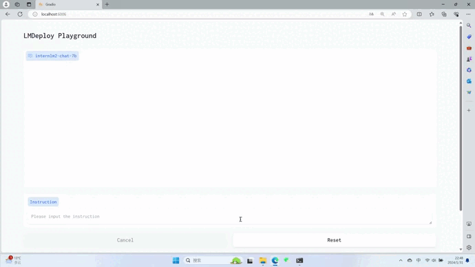

  

  
<h1>Quantification&Deployment
  
</h1>

本项目基于 [**LMDeploy**](https://github.com/InternLM/Imdeploy) 完成模型的量化和部署工作，关于工具这里不做具体介绍，可以参考 [05 LMDeploy大模型量化部署实践](https://blog.csdn.net/Wzxdecsdn/article/details/135623580) 进行了解。这里展示基于 [ Legal-Eagle-InternLM2-chat-7B-Merged](https://www.modelscope.cn/models/wangzixinxinxin/Legal-Eagle-InternLM2-chat-7B-Merged/files) 的量化部署流程。

## ⚗️ 4-bit Quantification & TurboMind Inference

推理速度非常快，显存占用为 **7GB** ，且推理精度并没有大幅下降
 
## 🔬Experiments

本项目比较了HuggingFace推理、TurboMind推理、4bit-TuborMind推理在启动时的显存占用如下（使用上述的参数，KV Cache量化本项目也做过实验，但是由于固定cache_chunk_size = 1且这里只考虑启动时的显存占用没有考虑推理时的KV Cache显存占用情况，故不对其做讨论）：

| Model                                                                                                       | HuggingFace                                                                                               | TurboMind                                                                                                                                                                | 4bit-Turbomind
|:------------------------------------------------------------------------------------------------------------|:---------------------------------------------------------------------------------------------------------------|:------------------------------------------------------------------------------------------------------------|:-----------------------------------------------------------------------------------------------------------------------------------------------------------------------------|
**InternLM2-chat-7B**                          | **15816** MB                                 |**16258** MB| **6500** MB    |       
**InternLM2-chat-20B**                         |          **35942** MB                    |**39566** MB| **13452** MB                             |
