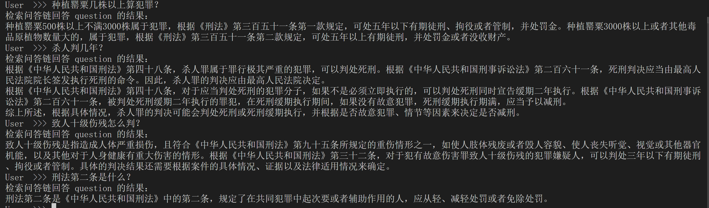

<div align="center">
  


</div><div align="left">
<h1>Retrieval Augmented Generation</h1>
</div>

Retrieval Augmented Generation (RAG) 指检索增强生成。RAG通过外挂知识库，并根据用户的提问在知识库中检索匹配的内容，生成上下文连同用户提问一起送给LLM生成回答。

## 💼 Requirements
- langchain == 0.1.1
- sentence-transformers == 2.2.2

## 📀 Demo (in cmd)



## 🚩 Operation
### 1. 向量数据库生成
首先，将'../laws'下的法律文件分块、向量化并保存到硬盘上。生成向量数据库的文件为`data_create.py`。其中可修改的部分包括：
+ Line 10: `file_loader = LawLoader('../laws')`，可修改为自己的法律文件目录。
+ Line 19: `embeddings = HuggingFaceEmbeddings(model_name="/root/sentence-transformer")`，可修改为自己的embedding模型路径。如不修改，需要在root文件夹下下载好`sentence-transformer`。
+ Line 21: `persist_directory = 'data_base/chroma'`，向量数据库的存储位置。

路径参数设置完毕后，运行：
```
python data_create.py
```
即可生成向量数据库并保存至路径`persist_directory`下。

### 2. 检索问答
检索问答的脚本为`retrievalQA.py`。其中需要设置的部分为：
+ Line 13: embedding模型的路径
+ Line 16: 向量数据库的路径，注意和上文保持一致
+ Line 24: 自己`Intern_LM`模型的路径
设置完毕后，运行
```
python retrievalQA.py
```
即可进行检索生成问答。
