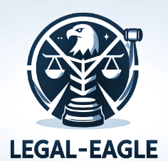

<div align="center">
  


</div><div align="left">
<h1>Supervised Fine Tuning
</h1>
</div>

本项目分别在 **30w条法律问答** [DISC-Law-SFT 数据集](https://huggingface.co/datasets/ShengbinYue/DISC-Law-SFT) 微调了[InternLM-chat-7B](https://huggingface.co/internlm/internlm-chat-7b)、[InternLM2-chat-7B](https://huggingface.co/internlm/internlm2-chat-7b)两款模型，并公布权重。另外在[52k单轮问答和带有法律依据的情景问答92k数据集](https://github.com/LiuHC0428/LAW-GPT) 上微调了[InternLM2-chat-20B](https://huggingface.co/internlm/internlm2-chat-20b)模型，并公布权重。

## 📄 Dataset Description

### 01 30w条法律问答 [DISC-Law-SFT 数据集](https://huggingface.co/datasets/ShengbinYue/DISC-Law-SFT) 

<table>
  <tr>
    <th>数据集</th>
    <th>对应任务/来源</th>
    <th>样本量</th>
    <th>对应情境</th>
  </tr>
  <tr>
    <td rowspan="10">DISC-Law-SFT-Pair</td>
    <td>司法要素提取</td>
    <td>32K</td>
    <td rowspan="7">法律专业人员助手</td>
  </tr>
  <tr>
    <td>司法事件检测</td>
    <td>27K</td>
  </tr>
  <tr>
    <td>案件分类</td>
    <td>20K</td>
  </tr>
  <tr>
    <td>判决预测</td>
    <td>11K</td>
  </tr>
  <tr>
    <td>类案匹配</td>
    <td>8K</td>
  </tr>
  <tr>
    <td>司法摘要</td>
    <td>9K</td>
  </tr>
  <tr>
    <td>舆情摘要</td>
    <td>6K</td>
  </tr>
  <tr>
    <td>法律问答</td>
    <td>93K</td>
    <td>法律咨询服务</td>
  </tr>
  <tr>
    <td>司法阅读理解</td>
    <td>38K</td>
    <td rowspan="2">法律考试助手</td>
  </tr>
  <tr>
    <td>法律考试</td>
    <td>12K</td>
  </tr>
  <tr>
    <td rowspan="2">DISC-Law-SFT-Triplet</td>
    <td>判决预测</td>
    <td>16K</td>
    <td>法律专业人员助手</td>
  </tr>
  <tr>
    <td>法律问答</td>
    <td>23K</td>
    <td>法律咨询服务</td>
  </tr>
  <tr>
    <td>总计</td>
    <td colspan="3">295K</td>
  </tr>
</table>

### 02 52k单轮问答和带有法律依据的情景问答92k数据集[链接](https://github.com/LiuHC0428/LAW-GPT) 
真实的中文律师用户问答数据，来自[CrimeKgAssitant](https://github.com/liuhuanyong/CrimeKgAssitant)收集的200k条情景对话数据。 

#### 利用ChatGPT清洗CrimeKgAssitant数据集得到52k单轮问答  


利用ChatGPT根据CrimeKgAssitant的问答重新生成，使得生成的回答比原回答更详细，语言组织更规范。
 
#### 带有法律依据的情景问答92k  

根据[中华人民共和国法律手册](https://github.com/RanKKI/LawRefBook)上最核心的9k法律条文，利用ChatGPT联想生成具体的情景问答，从而使得生成的数据集有具体的法律依据。
数据格式如下：
```json
"question": "在某家公司中，一名员工对女同事实施了性骚扰行为，女同事向公司进行举报，但公司却没有采取必要的措施来制止这种行为。\n\n公司未采取必要措施预防和制止性骚扰，导致女同事的权益受到侵害，该公司是否需要承担责任？"
"answer": "根据《社会法-妇女权益保障法》第八十条规定，“学校、用人单位违反本法规定，未采取必要措施预防和制止性骚扰，造成妇女权益受到侵害或者社会影响恶劣的，由上级机关或者主管部门责令改正；拒不改正或者情节严重的，依法对直接负责的主管人员和其他直接责任人员给予处分。”因此，该公司因为未采取必要措施预防和制止性骚扰行为，应该承担责任，并依法接受相关的处分。女同事可以向上级机关或主管部门进行申诉，要求该公司被责令改正，并对相关负责人员给予处分。"
"reference": [
            "社会法-妇女权益保障法2022-10-30:    \"第七十九条 违反本法第二十二条第二款规定，未履行报告义务的，依法对直接负责的主管人员和其他直接责任人员给予处分。\",\n",
            "社会法-妇女权益保障法2022-10-30:    \"第八十条 违反本法规定，对妇女实施性骚扰的，由公安机关给予批评教育或者出具告诫书，并由所在单位依法给予处分。\",\n",
            "社会法-妇女权益保障法2022-10-30:    \"学校、用人单位违反本法规定，未采取必要措施预防和制止性骚扰，造成妇女权益受到侵害或者社会影响恶劣的，由上级机关或者主管部门责令改正；拒不改正或者情节严重的，依法对直接负责的主管人员和其他直接责任人员给予处分。\",\n",
            "社会法-妇女权益保障法2022-10-30:    \"第八十一条 违反本法第二十六条规定，未履行报告等义务的，依法给予警告、责令停业整顿或者吊销营业执照、吊销相关许可证，并处一万元以上五万元以下罚款。\",\n"
        ]
```

## 🔎 Training Detail

### [ Legal-Eagle-InternLM-chat-7B](https://www.modelscope.cn/models/wangzixinxinxin/Legal-Eagle-InternLM-chat-7B-Merged)  

```
accelerate launch  supervised_finetuning.py \
    --per_device_train_batch_size 1 \
    --per_device_eval_batch_size 1 \
    --use_peft True \
    --model_max_length 2048 \
    --num_train_epochs 2 \
    --learning_rate 2e-5 \
    --warmup_ratio 0.05 \
    --weight_decay 0.05 \
    --gradient_accumulation_steps 32 \
    --preprocessing_num_workers 4 \
    --target_modules all \
    --lora_rank 8 \
    --lora_alpha 16 \
    --lora_dropout 0.05 \
    --fp16 \
    --device_map auto \
    --gradient_checkpointing True \
    --cache_dir ./cache

```
在 **4** 张 **Nvidia GeForce RTX 4090** 上运行约10h完成训练，loss收敛至0.5左右。

---------------------------------- **Legal-Eagle-InternLM-chat-7B-loss** ---------------------------------- 
<div align="left">
    
</div>

### [ Legal-Eagle-InternLM2-chat-7B](https://www.modelscope.cn/models/wangzixinxinxin/Legal-Eagle-InternLM2-chat-7B-Merged) 

```
accelerate launch  src/train_bash.py \
    --stage sft \
    --do_train \
    --finetuning_type lora \
    --lora_target all \
    --output_dir first_intern2_output \
    --overwrite_cache \
    --per_device_train_batch_size 4 \
    --gradient_accumulation_steps 8 \
    --lr_scheduler_type cosine \
    --logging_steps 10 \
    --save_steps 400 \
    --learning_rate 5e-5 \
    --num_train_epochs 2.0 \
    --plot_loss \
    --fp16
```
在 **7** 张 **NVIDIA GeForce RTX 4090** 上运行约7h完成训练，loss收敛至0.4左右。

---------------------------------- **Legal-Eagle-InternLM2-chat-7B-loss** ---------------------------------- 
<div align="left">
    
</div>

### [ Legal-Eagle-InternLM2-chat-20B](https://www.modelscope.cn/models/wangzixinxinxin/Legal-Eagle-InternLM2-chat-20B-Adapter)

```

max_length = 2048
pack_to_max_length = True
batch_size = 4 
accumulative_counts = 16
dataloader_num_workers = 0
max_epochs = 2
optim_type = AdamW
lr = 1e-4
betas = (0.9, 0.999)
weight_decay = 0
max_norm = 1  # grad clip
warmup_ratio = 0.03
evaluation_freq = 1000
evaluation_inputs = ['请问离婚需要准备什么材料？', '销售鳄鱼皮包违法吗？']

```
在 **1/2** 张 **NVIDIA A100-SXM4-80GB** 上运行约60h (2.5day) 完成训练，loss收敛至0.9左右。
